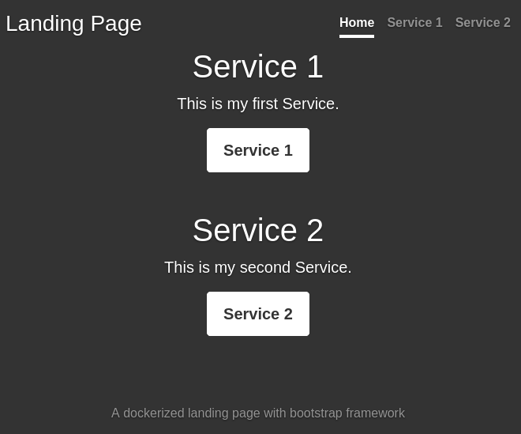

# simple-docker-lander

## What does this do?

It builds a very basic HTML landing page that contains links (passed in via an environment variable) and serves them.

Designed to fit elegantly into a `docker-compose.yml` file.

## How Simple?

Very simple - one file and less than 100 lines of Python.

## What does it look like?

It's plain and simple.




## Usage

Example `docker-compose.yml` file:

```
version: '3.1'
services:
  simple-docker-lander:
    image: user2k20/landing-page:latest
    # build: .
    restart: always
    ports:
      - 80:80
    environment:
      CONFIG: |
        site-name: Landing Page
        footer: A dockerized landing page with bootstrap framework
        links:
          - name: Service 1
            text: This is my first Service. 
            href: https://www.google.com/
          - name: Service 2
            text: My second Service. 
            href: https://reddit.com/
```

As you can see, just populate the `CONFIG` environment variable with a `YAML` string.

## Configuration

- `site-name`: the `<title>` value of the HTML document.
- `footer`: the footer of the document.
- `links`: a `YAML` array of items each containing both a `name` (link value), `text` (as description) and `href` (link target).

## Docker Build

Build and run the docker image.
```
$ git clone https://github.com/chris2k20/simple-docker-lander
$ docker build -t simple-docker-lander ./simple-docker-lander
$ docker run -it --rm -p 80:80 --name simple-docker-lander simple-docker-lander
```

## Forked 
This repo is forked from benletchford/simple-docker-lander - Thank you for your work! :) 
